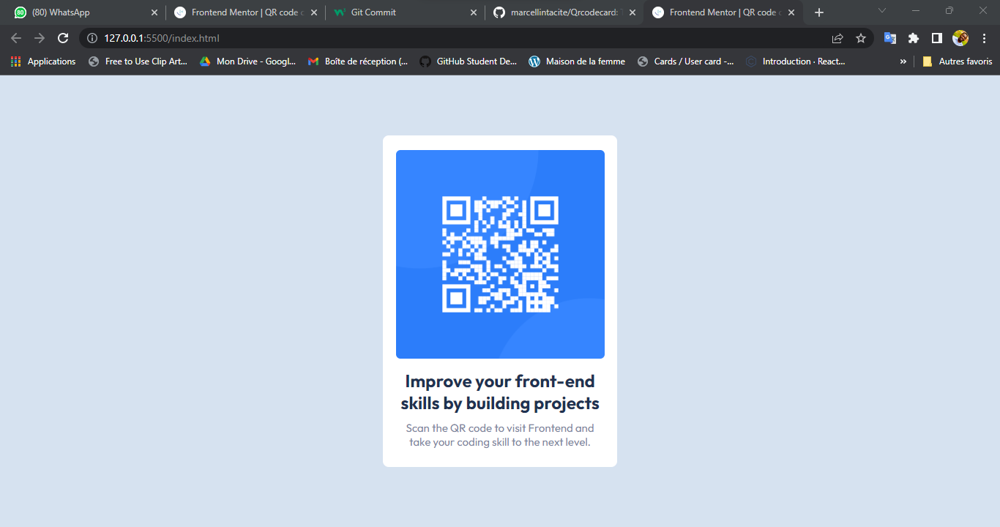

# Frontend Mentor - QR code component solution

This is a solution to the [QR code component challenge on Frontend Mentor](https://www.frontendmentor.io/challenges/qr-code-component-iux_sIO_H). Frontend Mentor challenges help you improve your coding skills by building realistic projects.

## Table of contents

- [Frontend Mentor - QR code component solution](#frontend-mentor---qr-code-component-solution)
  - [Table of contents](#table-of-contents)
  - [Overview](#overview)
    - [Screenshot](#screenshot)
    - [Links](#links)
  - [My process](#my-process)
    - [Built with](#built-with)
    - [What I learned](#what-i-learned)
  - [Author](#author)

## Overview

Voici un projet que j'ai tiré chez frontendmentor.

### Screenshot



### Links

- Solution URL: [Add solution URL here](https://github.com/marcellintacite/Qrcodecard)
- Live Site URL: [Add live site URL here](https://marcellintacite.github.io/Qrcodecard/)

## My process

### Built with

- Semantic HTML5 markup
- CSS custom properties
- Flexbox
- CSS Grid
- Mobile-first workflow

### What I learned

I learned a lot of things about html and design.

```html
<h1>This is so amazing</h1>
```

```css
.proud-of-this-css {
  color: papayawhip;
}
```

```js
const proudOfThisFunc = () => {
  console.log("🎉");
};
```

## Author

- Website - [Aksanti Bahiga tacite](https://www.aksantibahiga.live)
- Frontend Mentor - [@marcellintacite](https://www.frontendmentor.io/profile/marcellintacite)
- Twitter - [@BahigaTacite](https://www.twitter.com/BahigaTacite)
